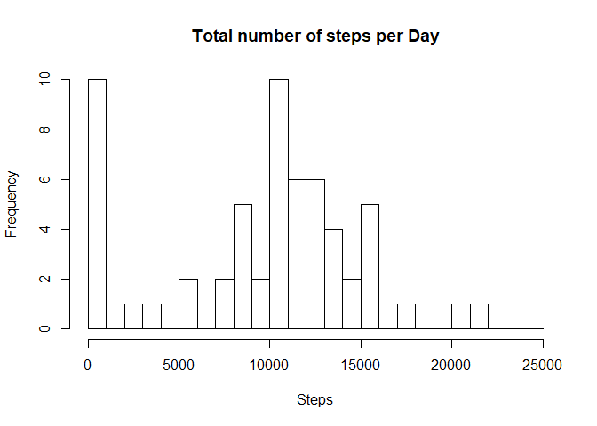
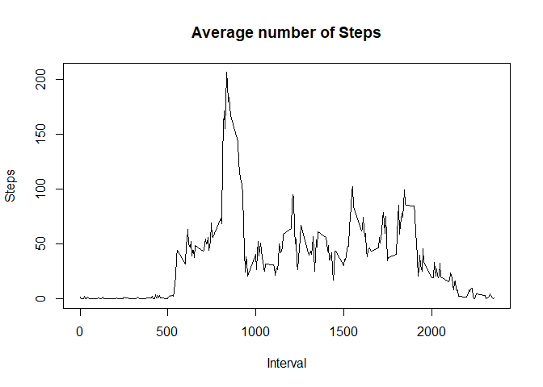
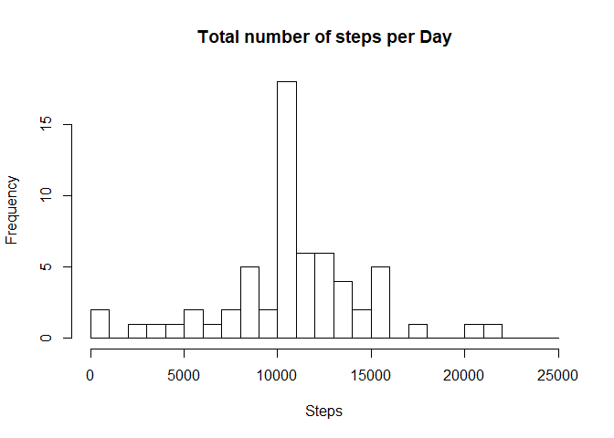
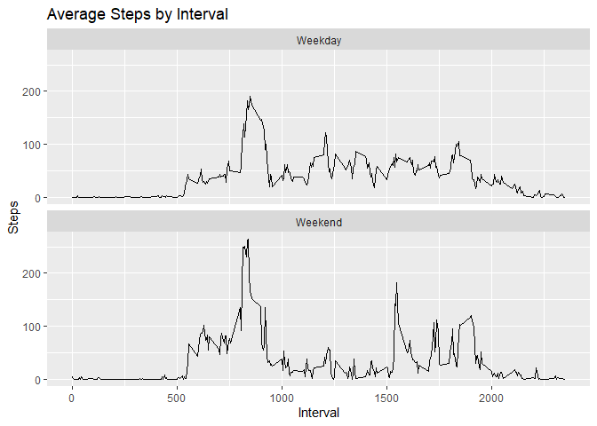

## Loading and preprocessing the data

```r
library(ggplot2)
```

```
## Warning: package 'ggplot2' was built under R version 3.6.1
```

```r
data <- read.csv("activity.csv")
```

## Summary of the data

```r
summary(data)
```

```
##      steps                date          interval     
##  Min.   :  0.00   2012-10-01:  288   Min.   :   0.0  
##  1st Qu.:  0.00   2012-10-02:  288   1st Qu.: 588.8  
##  Median :  0.00   2012-10-03:  288   Median :1177.5  
##  Mean   : 37.38   2012-10-04:  288   Mean   :1177.5  
##  3rd Qu.: 12.00   2012-10-05:  288   3rd Qu.:1766.2  
##  Max.   :806.00   2012-10-06:  288   Max.   :2355.0  
##  NA's   :2304     (Other)   :15840
```

## What is mean total number of steps taken per day?

```r
total_steps <- with(data, aggregate(steps, by = list(date), FUN = sum, na.rm = TRUE))
names(total_steps) <- c("Date", "Total")
hist(total_steps$Total, main = "Total number of steps per Day", xlab = "Steps", breaks = seq(0,25000, by=1000))
```

<!-- -->

## Mean and Median steps per day.

```r
mean(total_steps$Total, na.rm = TRUE)
```

```
## [1] 9354.23
```

```r
median(total_steps$Total, na.rm = TRUE)
```

```
## [1] 10395
```

## Group the data by interval and find the mean number of steps in each interval.

```r
interval_steps <- with(data, aggregate(steps, by = list(interval), FUN = mean, na.rm = TRUE))
names(interval_steps) <- c("Interval", "Average_Steps")
plot(interval_steps, type = "l", main = "Average number of Steps", xlab = "Interval", ylab = "Steps")
```

<!-- -->

## Find the interval with the maximum average number of steps.

```r
interval_steps[which.max(interval_steps$Average_Steps), ]$Interval
```

```
## [1] 835
```

## Imputing missing values
Find the number of NAs in the original dataset.

```r
nrow(data[is.na(data$steps),])
```

```
## [1] 2304
```

## Create a new dataset that is equal to the original dataset but with the missing data filled in.
Check the original data set and find all the NAs, then replace them with the average steps by interval

```r
imputed_data <- transform(data, steps = ifelse(is.na(data$steps), interval_steps$Average_Steps, data$steps))
```

## Total number of steps taken and the imputed data set.

```r
imputed_total_steps <- with(imputed_data, aggregate(steps, by = list(date), FUN = sum, na.rm = TRUE))
names(imputed_total_steps) <- c("Date", "Total")
hist(imputed_total_steps$Total, main = "Total number of steps per Day", xlab = "Steps", breaks = seq(0,25000, by=1000))
```

<!-- -->

## Find the mean and median steps in the imputed data set.

```r
mean(imputed_total_steps$Total, na.rm = TRUE)
```

```
## [1] 10766.19
```

```r
median(imputed_total_steps$Total, na.rm = TRUE)
```

```
## [1] 10766.19
```

## Format the date and find weekdays, then add it to the original data set.

```r
data$date <- as.POSIXct.Date(data$date, "%Y-%m-%d")
day_of_week <- data.frame(weekdays(data$date))
day_of_week$type_of_day <- ifelse(day_of_week == "Saturday" | day_of_week == "Sunday", "Weekend", "Weekday")
data <- cbind(data, day_of_week$type_of_day)
names(data) <- c("steps", "date", "interval", "type_of_day")
```

## Plot the average daily steps by interval.

```r
activity_by_type <- aggregate(steps ~ interval + type_of_day, data, mean, na.rm = TRUE)
activity_plot <- ggplot(activity_by_type, aes(x = interval, y = steps)) + 
  geom_line() + 
  labs(title = "Average Steps by Interval", x = "Interval", y = "Steps") + 
  facet_wrap(~type_of_day, nrow = 2, ncol = 1)
print(activity_plot)
```

<!-- -->
